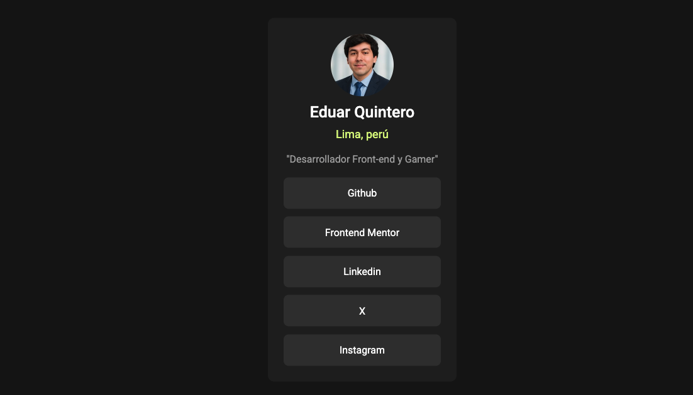

<h1 align=center>Enlace Social</h1>

 

Este proyecto se trata de un card en el cual se puede ver los accesos a distintos redes sociales o lo que el usuario quiera mostrar, incluye una pequeña descripción de la persona.

 
 
 
 
 

<h2>Vista Escritorio</h2>

<h2>Vista Móvil</h2>
